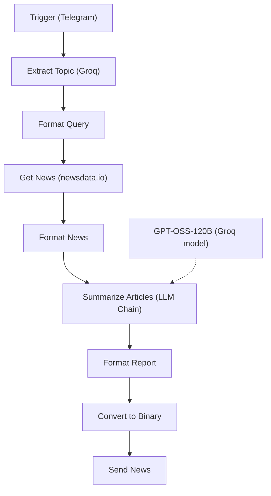

# News Sender

A Telegram bot that takes a topic in plain English, maps it to a news category, pulls current articles for that category, and sends back a structured 10-point analytical summary plus a conclusion as a Markdown file.

## What it does

1. You send a topic, for example `ai`, `latest tesla news`, or `cricket`. Any text message triggers the workflow.
2. An LLM classifies the message into one of 18 fixed news categories. It defaults to `technology,sports` if no topic is given or it can't tell.
3. The category is used to query the newsdata.io API for current English-language articles.
4. Up to 20 articles (title and description) are formatted into a numbered list.
5. An LLM chain writes exactly 10 numbered points plus a conclusion of 5–7 sentences. It is instructed to use only the provided articles and not to invent facts.
6. The report is normalized, converted into a `.md` file, and sent back as a Telegram document.

## Example

A full report from a live run is in [`examples/news_report.md`](examples/news_report.md). It is a snapshot of that day's news. The format is:

```markdown
1. The Florida High School Athletic Association (FHSAA) released its first weekly
   volleyball rankings as the sport reaches the midway point of the regular season. ...

2. Houston Astros third baseman Alex Bregman described himself as "super lucky" ...

...

**Conclusion:** The collection of news highlights a period of transition and
uncertainty across sports, finance, and politics. ...
```

## Flow



## Design decisions

- **The LLM picks the category, not the facts.** Every claim in the report traces back to an article that newsdata.io returned.
- **The classifier's output is constrained.** It runs at temperature 0 in JSON mode against a fixed list of 18 categories. **Format Query** falls back to `technology,sports` if the JSON is missing or invalid, so a bad classification doesn't stop the run.
- **The summarizer's rules are explicit.** The prompt says to use only the provided text, merge duplicate stories, write 3–4 sentences per point, and never add speculation.

<details>
<summary>The 18 categories</summary>

business, crime, domestic, education, entertainment, environment, food, health, lifestyle, other, politics, science, sports, technology, top, tourism, world, gaming

</details>

## Tech stack

| Component | Role |
|---|---|
| n8n (with LangChain nodes) | Orchestration |
| Telegram Bot API | Trigger and document delivery |
| Groq `openai/gpt-oss-20b` | Category classification |
| Groq `openai/gpt-oss-120b` | Article summarization (LLM Chain) |
| newsdata.io API | Current news articles by category |

## Setup

1. Import [`Send_News_Based_on_The_Query.json`](Send_News_Based_on_The_Query.json) into n8n.
2. Attach credentials:
   - Telegram API → **Trigger**, **Send News**
   - Groq API → **Extract Topic**, **GPT-OSS-120B** (the model used by the LLM Chain)
   - Query Auth → **Get News**. newsdata.io takes its key as a query parameter, so create a Query Auth credential with name `apikey` and your key as the value.
3. Activate the workflow and message the bot with a topic.


## Limitations

- **Category-level, not topic-level.** The API request filters by category and language only, with no keyword. "latest tesla news" maps to `business` and returns general business news, not Tesla news.
- **Fewer than 20 articles in practice.** The workflow reads up to 20 articles, but newsdata.io's free plan returns about 10 per request. 
- **English only.** The request hardcodes `language=en`.
- **Summaries use titles and descriptions only.** Articles with empty descriptions contribute just a headline, which limits how much detail a point can carry.
